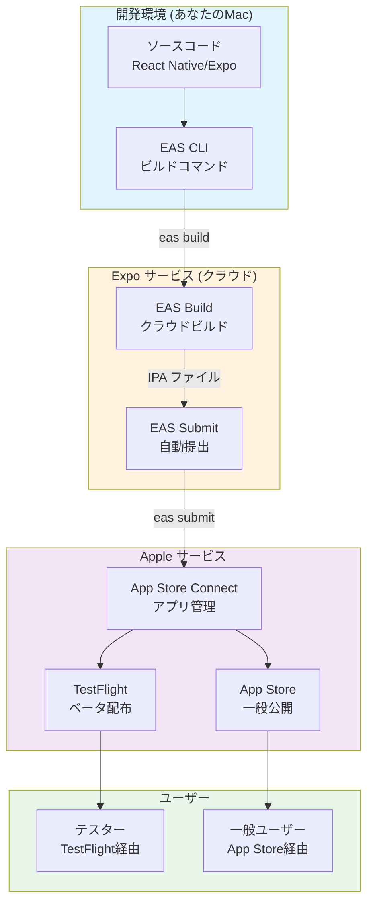
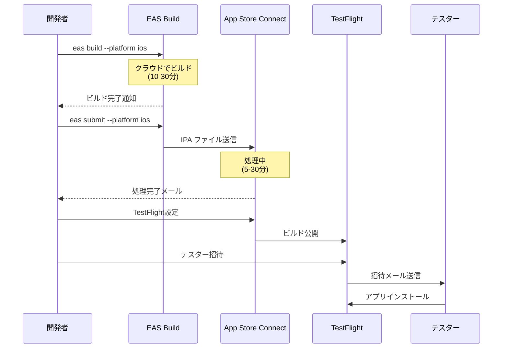
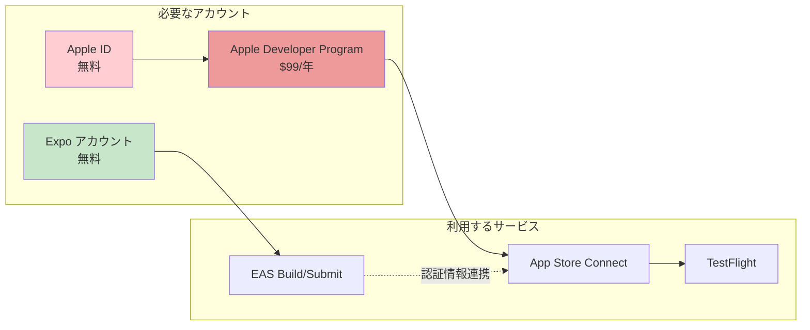
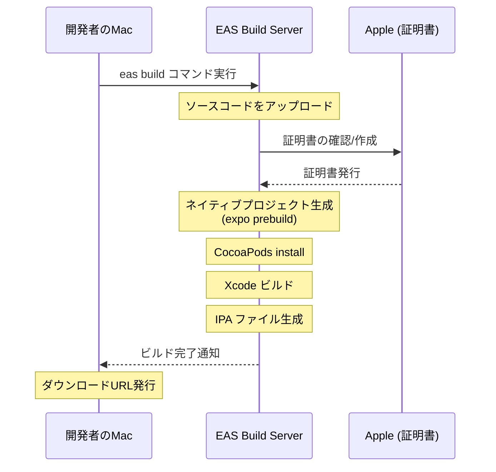
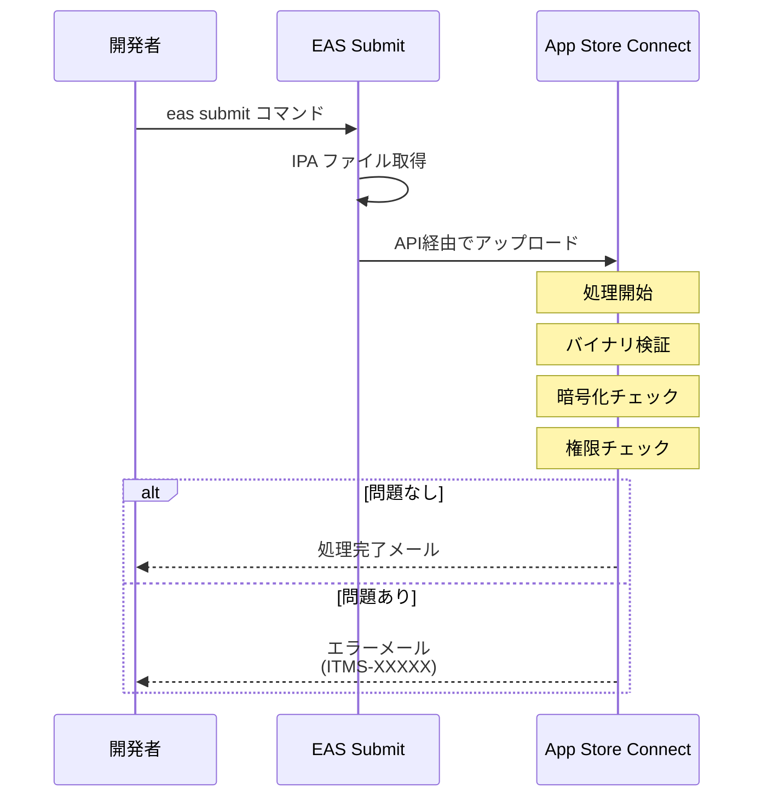
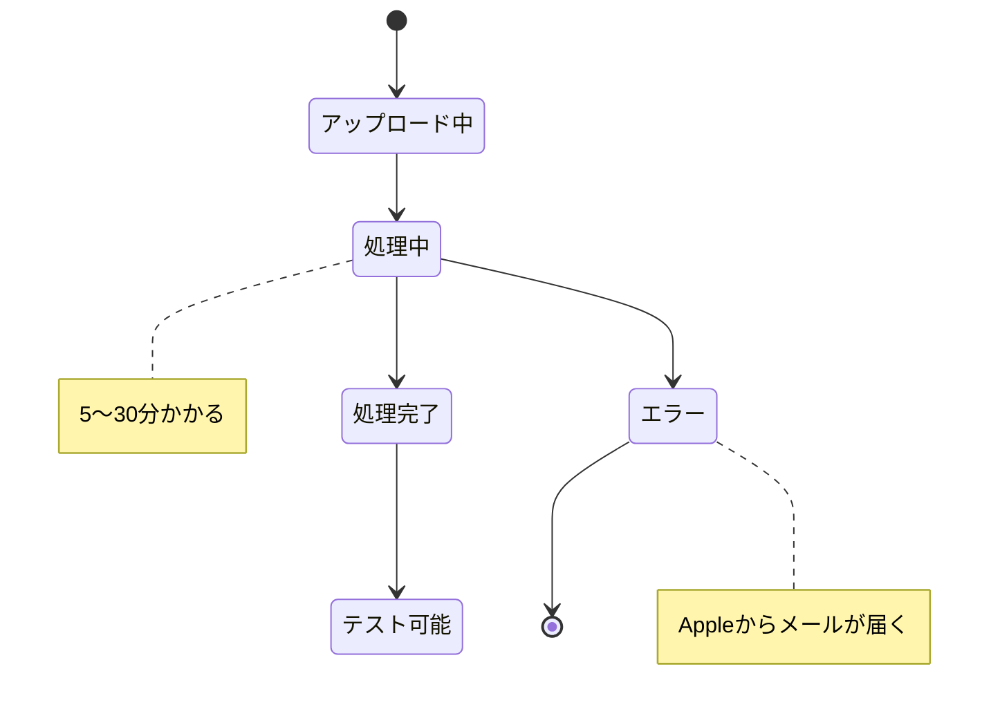
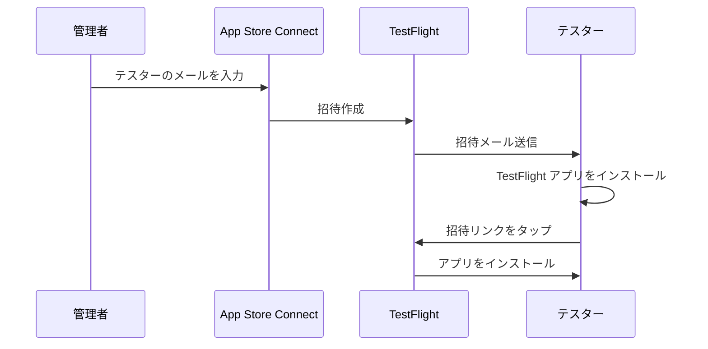
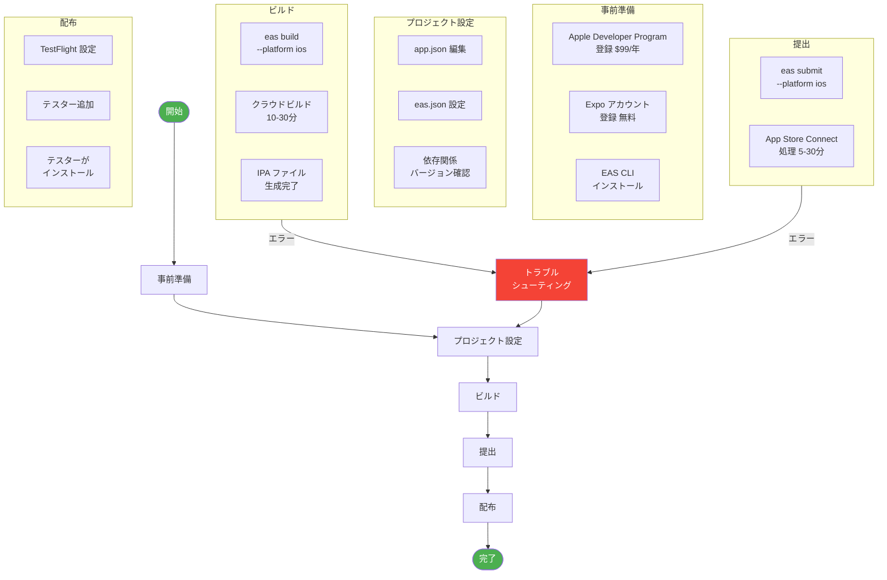

# React Native (Expo) アプリを App Store に公開するガイド

このドキュメントは、React Native (Expo) で開発したiOSアプリを App Store / TestFlight に公開するまでの過程を初心者向けに解説します。

## 目次

1. [全体像](#全体像)
2. [必要なアカウントとサービス](#必要なアカウントとサービス)
3. [事前準備](#事前準備)
4. [ステップ1: EAS CLIのセットアップ](#ステップ1-eas-cliのセットアップ)
5. [ステップ2: プロジェクトの設定](#ステップ2-プロジェクトの設定)
6. [ステップ3: 本番ビルドの作成](#ステップ3-本番ビルドの作成)
7. [ステップ4: App Store Connectへの提出](#ステップ4-app-store-connectへの提出)
8. [ステップ5: TestFlightでの配布](#ステップ5-testflightでの配布)
9. [トラブルシューティング](#トラブルシューティング)
10. [用語集](#用語集)

---

## 全体像

### 関係するサービスと役割



### ビルドから公開までの流れ



---

## 必要なアカウントとサービス

### 1. Apple Developer Program (必須・有料)

| 項目 | 内容 |
|------|------|
| **費用** | 年間 $99 (約15,000円) |
| **用途** | App Store / TestFlight への公開に必須 |
| **登録URL** | https://developer.apple.com/programs/ |
| **審査期間** | 個人: 即時〜数日 / 法人: 数週間 |

> ⚠️ **重要**: 無料の Apple ID だけでは TestFlight / App Store への公開はできません。

### 2. Expo アカウント (必須・無料)

| 項目 | 内容 |
|------|------|
| **費用** | 無料プランで OK |
| **用途** | EAS Build / EAS Submit の利用 |
| **登録URL** | https://expo.dev/signup |

### 3. App Store Connect (Apple Developer に含まれる)

| 項目 | 内容 |
|------|------|
| **URL** | https://appstoreconnect.apple.com |
| **用途** | アプリの管理、TestFlight配布、審査提出 |

### サービス間の関係



---

## 事前準備

### チェックリスト

- [ ] Apple Developer Program に登録済み ($99/年)
- [ ] Expo アカウント作成済み
- [ ] Xcode インストール済み (Mac)
- [ ] Node.js 18以上 インストール済み
- [ ] EAS CLI インストール済み

### Apple Developer Program 登録手順

1. https://developer.apple.com/programs/ にアクセス
2. 「Enroll」をクリック
3. Apple ID でサインイン
4. 個人/法人を選択
5. 支払い情報を入力 ($99)
6. **重要**: Team ID をメモしておく（後で使用）

### Team ID の確認方法

1. https://developer.apple.com/account にアクセス
2. 「Membership details」をクリック
3. **Team ID** をコピー (例: `ABC123DEF4`)

---

## ステップ1: EAS CLIのセットアップ

### EAS CLI のインストール

```bash
# グローバルインストール
npm install -g eas-cli

# バージョン確認
eas --version
```

### Expo へのログイン

```bash
# ログイン
eas login

# ログイン確認
eas whoami
```

---

## ステップ2: プロジェクトの設定

### app.json の設定

```json
{
  "expo": {
    "name": "YourAppName",
    "slug": "your-app-slug",
    "version": "1.0.0",
    "ios": {
      "bundleIdentifier": "com.yourname.yourapp",
      "buildNumber": "1",
      "supportsTablet": true,
      "infoPlist": {
        "NSMicrophoneUsageDescription": "音声機能に使用します",
        "ITSAppUsesNonExemptEncryption": false
      }
    },
    "extra": {
      "eas": {
        "projectId": "your-project-id"
      }
    }
  }
}
```

### eas.json の設定

```bash
# 初回設定（eas.json が自動生成される）
cd your-project
eas build:configure
```

生成された `eas.json` を編集:

```json
{
  "cli": {
    "version": ">= 5.0.0"
  },
  "build": {
    "development": {
      "developmentClient": true,
      "distribution": "internal"
    },
    "preview": {
      "distribution": "internal"
    },
    "production": {
      "env": {
        "EXPO_PUBLIC_API_URL": "https://your-production-api.com"
      }
    }
  },
  "submit": {
    "production": {
      "ios": {
        "appleId": "your-apple-id@example.com",
        "ascAppId": "App Store Connect の App ID",
        "appleTeamId": "YOUR_TEAM_ID"
      }
    }
  }
}
```

### 依存関係のバージョン確認 (重要!)

```bash
# Expo SDK との互換性チェック
npx expo install --check

# 警告が出た場合は修正
npx expo install --fix
```

> ⚠️ **警告**: 依存関係のバージョンが合っていないと、**ビルドは成功してもアプリが起動時にクラッシュ**します。

---

## ステップ3: 本番ビルドの作成

### ビルドコマンド

```bash
cd your-project

# iOS 本番ビルド
eas build --platform ios --profile production
```

### ビルドプロセス



### 初回ビルド時の質問

初回ビルド時に以下の質問が表示されます:

```
? Would you like to log in to your Apple account? (Y/n)
→ Y を選択

? Apple ID:
→ Apple Developer に登録したメールアドレス

? Password (for Apple ID):
→ パスワード（またはApp用パスワード）

? Would you like to reuse this distribution certificate? (Y/n)
→ Y を選択（既存の証明書がある場合）
```

### ビルド状況の確認

```bash
# ビルド一覧
eas build:list

# 特定ビルドの詳細
eas build:view
```

または https://expo.dev でダッシュボードを確認

---

## ステップ4: App Store Connectへの提出

### 提出コマンド

```bash
# 最新のビルドを提出
eas submit --platform ios --latest

# または特定のビルドを提出
eas submit --platform ios --id BUILD_ID
```

### 提出時の質問

```
? What would you like to submit?
→ Select a build from EAS

? Which build would you like to submit?
→ 提出したいビルドを選択

? Would you like to create a new App Store Connect app?
→ 初回は Yes、2回目以降は既存のアプリを選択
```

### 提出プロセス



### よくあるエラー

| エラーコード | 原因 | 解決方法 |
|-------------|------|----------|
| ITMS-90683 | Info.plist の権限説明が不足 | app.json の infoPlist に追加 |
| ITMS-90717 | 無効なバイナリ | ビルドを再作成 |
| ITMS-4238 | 重複したバンドルID | buildNumber を更新 |

---

## ステップ5: TestFlightでの配布

### App Store Connect での設定

1. https://appstoreconnect.apple.com にアクセス
2. 「マイApp」からアプリを選択
3. 「TestFlight」タブをクリック

### ビルドの処理状態



### テスターの追加

#### 内部テスター (チームメンバー)
- 最大100人
- 審査なし
- 即時配布可能

#### 外部テスター
- 最大10,000人
- 軽い審査あり (1-2日)
- メールアドレスで招待

### テスターの招待手順



### テスターへの案内

テスターに以下を伝えてください:

1. **TestFlight アプリ**を App Store からインストール
2. 招待メールの**リンクをタップ**
3. TestFlight アプリが開いたら**「インストール」**をタップ

---

## トラブルシューティング

### ビルドは成功するがアプリが起動時にクラッシュする

**最も多い原因**: Expo SDK と依存関係のバージョン不一致

```bash
# バージョンチェック
npx expo install --check

# 修正
npx expo install --fix

# node_modules を再生成
rm -rf node_modules package-lock.json
npm install

# 再ビルド
eas build --platform ios --profile production
```

**Expo SDK 54 の推奨バージョン**:
```json
{
  "react": "19.1.0",
  "react-dom": "19.1.0",
  "react-native-gesture-handler": "~2.28.0",
  "react-native-safe-area-context": "~5.6.0",
  "react-native-screens": "~4.16.0"
}
```

### App Store Connect でビルドが表示されない

1. **処理中の可能性**: 5-30分待つ
2. **エラーメール確認**: Apple からのメールをチェック
3. **再提出**: `eas submit --platform ios --latest`

### ITMS-90683 エラー (権限不足)

app.json に必要な権限説明を追加:

```json
{
  "expo": {
    "ios": {
      "infoPlist": {
        "NSMicrophoneUsageDescription": "マイクの使用目的",
        "NSCameraUsageDescription": "カメラの使用目的",
        "NSPhotoLibraryUsageDescription": "写真ライブラリの使用目的"
      }
    }
  }
}
```

### 証明書関連のエラー

```bash
# 証明書を再作成
eas credentials

# または完全にリセット
eas build --platform ios --clear-credentials
```

---

## 用語集

| 用語 | 説明 |
|------|------|
| **EAS** | Expo Application Services - Expo のクラウドビルド/提出サービス |
| **IPA** | iOS App Store Package - iOS アプリのインストールファイル |
| **Bundle Identifier** | アプリの一意な識別子 (例: com.example.myapp) |
| **Build Number** | 同じバージョン内での連番。提出ごとに増やす必要がある |
| **Provisioning Profile** | アプリの署名に必要な証明書情報 |
| **TestFlight** | Apple の公式ベータテスト配布サービス |
| **App Store Connect** | アプリの管理・審査・配布を行う Apple のポータル |

---

## 完全なワークフロー図



---

## 参考リンク

- [Expo EAS Build ドキュメント](https://docs.expo.dev/build/introduction/)
- [Expo EAS Submit ドキュメント](https://docs.expo.dev/submit/introduction/)
- [Apple Developer Program](https://developer.apple.com/programs/)
- [App Store Connect ヘルプ](https://developer.apple.com/help/app-store-connect/)
- [TestFlight ガイド](https://developer.apple.com/testflight/)

---

*最終更新: 2024年12月*
