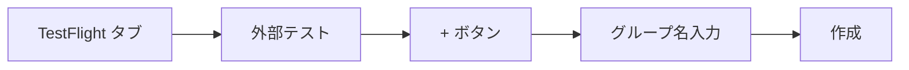
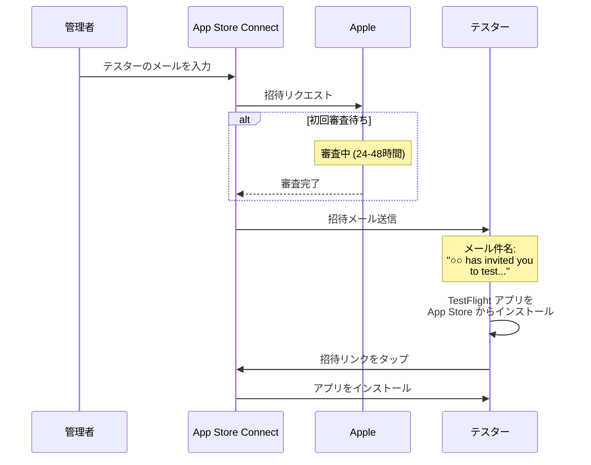

# TestFlight 外部テスターの招待ガイド

## 内部テスター vs 外部テスター

| 項目 | 内部テスター | 外部テスター |
|------|-------------|-------------|
| **対象** | Apple Developer チームメンバーのみ | 誰でも (メールアドレスで招待) |
| **最大人数** | 100人 | 10,000人 |
| **審査** | 不要 | 軽い審査あり (通常24-48時間) |
| **用途** | 開発チーム内テスト | 社員、クライアント、ベータユーザー |

> **あなたのケース**: 社員をテスターとして招待する場合は「**外部テスター**」になります。

---

## 外部テスター招待の手順

### ステップ1: App Store Connect にアクセス

1. https://appstoreconnect.apple.com にアクセス
2. Apple ID でサインイン
3. 「マイApp」からアプリを選択

### ステップ2: TestFlight タブを開く

```
┌─────────────────────────────────────────────────────────┐
│ App Store Connect                                       │
├─────────────────────────────────────────────────────────┤
│                                                         │
│  [App Store] [TestFlight] [一般] [価格と配信状況]        │
│              ↑                                          │
│          ここをクリック                                  │
│                                                         │
└─────────────────────────────────────────────────────────┘
```

### ステップ3: 外部テスターグループを作成

1. 左サイドバーの「**外部テスト**」セクションを確認
2. 「**+**」ボタンをクリック
3. グループ名を入力 (例: 「社内テスター」)
4. 「作成」をクリック



### ステップ4: ビルドをグループに追加

1. 作成したグループを選択
2. 「**ビルド**」タブをクリック
3. 「**+**」ボタンをクリック
4. 配布したいビルドを選択
5. 「次へ」→ テスト情報を入力 → 「送信」

> **⚠️ 重要**: ビルドを追加しないと「**適合するビルドがありません**」と表示され、テスターはアプリをダウンロードできません。

> **初回のみ**: 外部テストには Apple の審査があります (通常24-48時間)

### ステップ4.5: テスト情報の入力（初回のみ）

外部テストには**Apple による審査**があるため、以下のテスト情報を入力する必要があります：

```
┌─────────────────────────────────────────────────────────┐
│ テスト情報                                                │
├─────────────────────────────────────────────────────────┤
│                                                         │
│  ベータ版アプリの説明 *                                    │
│  ┌─────────────────────────────────────────────────┐   │
│  │ VoiceChat is a real-time voice communication    │   │
│  │ app using WebRTC technology.                    │   │
│  │                                                 │   │
│  │ Key Features:                                   │   │
│  │ - One-on-one voice calls via room creation     │   │
│  │ - Real-time speech-to-text transcription       │   │
│  │ - Simple and intuitive user interface          │   │
│  │                                                 │   │
│  │ Testing Objectives:                            │   │
│  │ - Verify voice call quality and stability      │   │
│  │ - Evaluate transcription accuracy              │   │
│  │ - Test performance across network conditions   │   │
│  └─────────────────────────────────────────────────┘   │
│                                                         │
│  フィードバックメールアドレス *                            │
│  [your-email@example.com                         ]      │
│                                                         │
│  連絡先情報                                               │
│  姓: [Yamada        ]  名: [Taro          ]             │
│  電話番号: [+81-90-xxxx-xxxx]                            │
│  メールアドレス: [your-email@example.com       ]         │
│                                                         │
│  サインイン情報                                           │
│  ☐ サインインが必要です                                   │
│    ↑ ログイン不要なアプリはチェックを外す                   │
│                                                         │
└─────────────────────────────────────────────────────────┘
```

**注意点**:
- **ベータ版アプリの説明は英語で記載**することを推奨（Apple の審査担当者が確認するため）
- サインイン情報のパスワードは Apple の審査担当者がアプリをテストするために使用
- ログイン機能がないアプリは「サインインが必要です」のチェックを外す

#### テスト情報の例文（英語）

```
VoiceChat is a real-time voice communication app using WebRTC technology.

Key Features:
- One-on-one voice calls via room creation and joining
- Real-time speech-to-text transcription (Japanese)
- Simple and intuitive user interface

Testing Objectives:
- Verify voice call quality and stability
- Evaluate transcription accuracy
- Test performance across different network conditions
```

### ステップ5: テスターを招待

テスターを招待する方法は **2つ** あります：

#### 方法A: メールアドレスで個別招待

1. グループを選択
2. 「**テスター**」タブをクリック
3. 「**+**」ボタンをクリック
4. 「**メールで新規テスターを追加**」を選択
5. テスターのメールアドレスを入力
6. 「追加」をクリック

```
┌─────────────────────────────────────────────────────────┐
│ テスターを追加                                           │
├─────────────────────────────────────────────────────────┤
│                                                         │
│  メールアドレス: [employee@company.co.jp        ]       │
│                                                         │
│  名 (オプション): [田中                          ]       │
│  姓 (オプション): [太郎                          ]       │
│                                                         │
│                              [キャンセル] [追加]         │
│                                                         │
└─────────────────────────────────────────────────────────┘
```

#### 方法B: パブリックリンクで招待（おすすめ）

パブリックリンクを使うと、URLを共有するだけで誰でもテスターとして参加できます。

1. グループを選択
2. 「**テスター**」タブをクリック
3. 「**パブリックリンク**」セクションの「**管理**」をクリック
4. 「**パブリックリンクを有効にする**」をオン
5. **テスター数の上限**を設定（例: 100人）
6. 生成されたURLをコピー

```
パブリックリンク例:
https://testflight.apple.com/join/m7gE28QD
                                  └── 招待コード
```

**パブリックリンクの使い方（テスター側）**:

1. iPhone で **Safari** を開く
2. パブリックリンクのURLにアクセス
3. TestFlight アプリが自動で開く
4. 「テストを開始」→「インストール」をタップ

> **⚠️ 注意**: TestFlight アプリ内の「コードを利用」からは参加**できません**。必ず **Safari でURLを開いて**ください。

**「このベータ版は現在新規テスターを受け付けていません」エラー**:

このエラーが表示される場合、以下を確認してください：

| 原因 | 解決方法 |
|------|---------|
| グループにビルドが追加されていない | ステップ4でビルドを追加 |
| テスター数の上限に達している | 上限を増やす（最大10,000人） |
| パブリックリンクが無効 | 「管理」から有効にする |
| ビルドが審査中 | 審査完了を待つ（24-48時間） |

---

## 招待メールの流れ



---

## テスターへの案内テンプレート

以下の内容をテスターに送ってください:

```
件名: アプリのテスト参加のお願い

お疲れ様です。

新しいアプリのテスト参加をお願いいたします。

【インストール手順】

1. App Store から「TestFlight」アプリをインストールしてください
   https://apps.apple.com/jp/app/testflight/id899247664

2. Apple から招待メールが届きます
   - 件名: "○○ has invited you to test..."
   - 送信元: no_reply@email.apple.com

3. メール内のリンクをタップしてください

4. TestFlight アプリが開いたら「インストール」をタップ

5. インストール完了後、アプリを起動できます

【注意事項】
- TestFlight 経由でインストールしたアプリは90日で期限切れになります
- 新しいバージョンがリリースされると通知が届きます
- フィードバックは TestFlight アプリから送信できます

ご不明点があればお知らせください。
```

---

## よくある質問

### Q: 招待メールが届かない

**確認事項**:
1. 迷惑メールフォルダを確認
2. `no_reply@email.apple.com` を受信許可
3. メールアドレスが正しいか確認
4. App Store Connect で招待が送信済みか確認

### Q: 「ビルドが処理中」のまま進まない

- 新しいビルドは処理に5-30分かかります
- 外部テストの審査は24-48時間かかります

### Q: テスターがインストールできない

**確認事項**:
1. テスターの iOS バージョンがアプリの最小要件を満たしているか
2. テスターが正しい Apple ID でサインインしているか
3. テスターのデバイスに空き容量があるか

### Q: 新しいビルドを配布したい

1. 新しいビルドを `eas build` で作成
2. `eas submit` で App Store Connect に送信
3. 既存のグループにビルドを追加
4. テスターには自動で更新通知が届きます

---

## 複数テスターの一括追加

CSV ファイルで一括追加することもできます:

1. 「テスター」タブ → 「**+**」
2. 「**CSVファイルをアップロード**」を選択
3. 以下の形式の CSV をアップロード:

```csv
first_name,last_name,email
太郎,田中,tanaka@company.co.jp
花子,山田,yamada@company.co.jp
一郎,佐藤,sato@company.co.jp
```

---

## ビルドの有効期限

| 項目 | 期限 |
|------|------|
| TestFlight ビルド | **90日** |
| 更新方法 | 新しいビルドを提出 |
| 自動通知 | 期限7日前にテスターへ通知 |

> **ヒント**: 新しいビルドを提出すると、テスターは TestFlight アプリから更新できます。

---

## 外部テストの審査について

### 審査時間の目安

| 状況 | 審査時間 |
|------|---------|
| 初回審査 | 24〜48時間 |
| 同じアプリの新ビルド | 数時間〜24時間（短い傾向） |
| シンプルなアプリ | 早め |
| 複雑な機能があるアプリ | やや長め |

> **ポイント**: App Store 本審査（1〜3日以上）より TestFlight 外部テスト審査は短いです。

### 審査ステータスの確認

App Store Connect → TestFlight → ビルド で確認できます：

| ステータス | 意味 |
|-----------|------|
| 処理中 | アップロード後の処理中 |
| 審査待ち | Apple の審査待ち |
| 審査中 | 審査が進行中 |
| **承認済み** | 外部テスター利用可能 |
| 却下 | 問題があり再提出が必要 |

### 審査で確認される内容

- アプリがクラッシュしないか
- 基本的な機能が動作するか
- プライバシーポリシーの有無（必要な場合）
- 不適切なコンテンツがないか

> **ヒント**: 初回審査が通れば、次回以降のビルド更新は審査が早くなる傾向があります。

---

*最終更新: 2025年12月*
