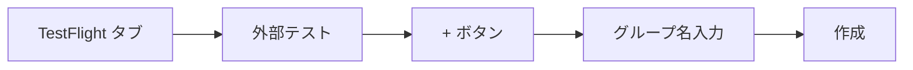
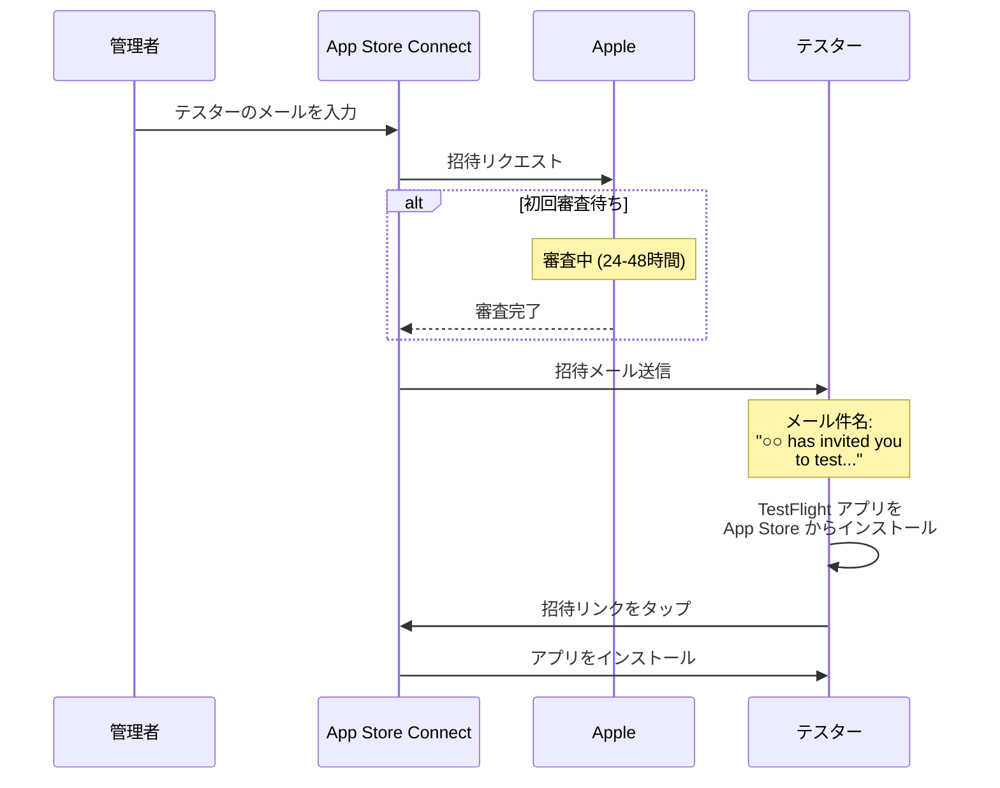

# TestFlight 外部テスターの招待ガイド

## 内部テスター vs 外部テスター

| 項目 | 内部テスター | 外部テスター |
|------|-------------|-------------|
| **対象** | Apple Developer チームメンバーのみ | 誰でも (メールアドレスで招待) |
| **最大人数** | 100人 | 10,000人 |
| **審査** | 不要 | 軽い審査あり (通常24-48時間) |
| **用途** | 開発チーム内テスト | 社員、クライアント、ベータユーザー |

> **あなたのケース**: 社員をテスターとして招待する場合は「**外部テスター**」になります。

---

## 外部テスター招待の手順

### ステップ1: App Store Connect にアクセス

1. https://appstoreconnect.apple.com にアクセス
2. Apple ID でサインイン
3. 「マイApp」からアプリを選択

### ステップ2: TestFlight タブを開く

```
┌─────────────────────────────────────────────────────────┐
│ App Store Connect                                       │
├─────────────────────────────────────────────────────────┤
│                                                         │
│  [App Store] [TestFlight] [一般] [価格と配信状況]        │
│              ↑                                          │
│          ここをクリック                                  │
│                                                         │
└─────────────────────────────────────────────────────────┘
```

### ステップ3: 外部テスターグループを作成

1. 左サイドバーの「**外部テスト**」セクションを確認
2. 「**+**」ボタンをクリック
3. グループ名を入力 (例: 「社内テスター」)
4. 「作成」をクリック



### ステップ4: ビルドをグループに追加

1. 作成したグループを選択
2. 「**ビルド**」タブをクリック
3. 「**+**」ボタンをクリック
4. 配布したいビルドを選択
5. 「次へ」→ テスト情報を入力 → 「送信」

> **初回のみ**: 外部テストには Apple の審査があります (通常24-48時間)

### ステップ5: テスターを招待

1. グループを選択
2. 「**テスター**」タブをクリック
3. 「**+**」ボタンをクリック
4. 「**メールで新規テスターを追加**」を選択
5. テスターのメールアドレスを入力
6. 「追加」をクリック

```
┌─────────────────────────────────────────────────────────┐
│ テスターを追加                                           │
├─────────────────────────────────────────────────────────┤
│                                                         │
│  メールアドレス: [employee@company.co.jp        ]       │
│                                                         │
│  名 (オプション): [田中                          ]       │
│  姓 (オプション): [太郎                          ]       │
│                                                         │
│                              [キャンセル] [追加]         │
│                                                         │
└─────────────────────────────────────────────────────────┘
```

---

## 招待メールの流れ



---

## テスターへの案内テンプレート

以下の内容をテスターに送ってください:

```
件名: アプリのテスト参加のお願い

お疲れ様です。

新しいアプリのテスト参加をお願いいたします。

【インストール手順】

1. App Store から「TestFlight」アプリをインストールしてください
   https://apps.apple.com/jp/app/testflight/id899247664

2. Apple から招待メールが届きます
   - 件名: "○○ has invited you to test..."
   - 送信元: no_reply@email.apple.com

3. メール内のリンクをタップしてください

4. TestFlight アプリが開いたら「インストール」をタップ

5. インストール完了後、アプリを起動できます

【注意事項】
- TestFlight 経由でインストールしたアプリは90日で期限切れになります
- 新しいバージョンがリリースされると通知が届きます
- フィードバックは TestFlight アプリから送信できます

ご不明点があればお知らせください。
```

---

## よくある質問

### Q: 招待メールが届かない

**確認事項**:
1. 迷惑メールフォルダを確認
2. `no_reply@email.apple.com` を受信許可
3. メールアドレスが正しいか確認
4. App Store Connect で招待が送信済みか確認

### Q: 「ビルドが処理中」のまま進まない

- 新しいビルドは処理に5-30分かかります
- 外部テストの審査は24-48時間かかります

### Q: テスターがインストールできない

**確認事項**:
1. テスターの iOS バージョンがアプリの最小要件を満たしているか
2. テスターが正しい Apple ID でサインインしているか
3. テスターのデバイスに空き容量があるか

### Q: 新しいビルドを配布したい

1. 新しいビルドを `eas build` で作成
2. `eas submit` で App Store Connect に送信
3. 既存のグループにビルドを追加
4. テスターには自動で更新通知が届きます

---

## 複数テスターの一括追加

CSV ファイルで一括追加することもできます:

1. 「テスター」タブ → 「**+**」
2. 「**CSVファイルをアップロード**」を選択
3. 以下の形式の CSV をアップロード:

```csv
first_name,last_name,email
太郎,田中,tanaka@company.co.jp
花子,山田,yamada@company.co.jp
一郎,佐藤,sato@company.co.jp
```

---

## ビルドの有効期限

| 項目 | 期限 |
|------|------|
| TestFlight ビルド | **90日** |
| 更新方法 | 新しいビルドを提出 |
| 自動通知 | 期限7日前にテスターへ通知 |

> **ヒント**: 新しいビルドを提出すると、テスターは TestFlight アプリから更新できます。

---

*最終更新: 2024年12月*
